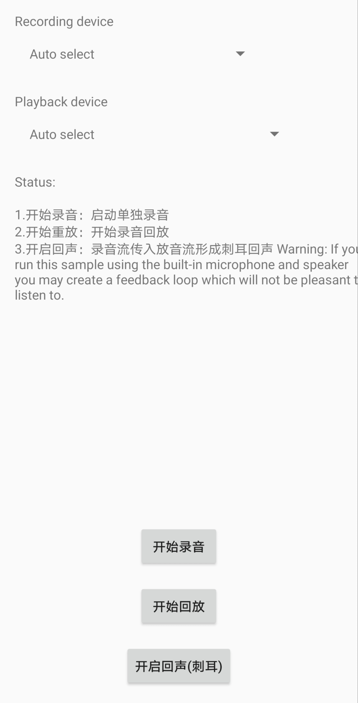

# AAudioDemo
### 1.简介
AAuido demo [Blog介绍](https://www.jianshu.com/p/74488bc07b30)，[基于官方Demo](https://github.com/googlearchive/android-audio-high-performance)的AAudio API使用总结
包含录放音，写Wav音频头，回声处理(录音流立刻用于播放流)，[官网介绍](https://developer.android.google.cn/ndk/guides/audio/aaudio/aaudio)

### 2.注意事项
(1)录音回调中如下代码中的返回值AAUDIO_CALLBACK_RESULT_CONTINUE表示继续录音或放音
返回AAUDIO_CALLBACK_RESULT_STOP则表示停止录音或停止放音，音频流状态将转为停止
```
aaudio_data_callback_result_t EchoAudioEngine::dataToRecordCallback(AAudioStream *stream,
                                                                    void *audioData,
                                                                    int32_t numFrames) {
    static uint64_t logging_flag;
    if (isRecordIng) {
        fwrite(audioData, 1, 2 * numFrames * sizeof(short), recordFile);
        if ((logging_flag++) % 100 == 0) {
            LOGI("AAudioEngineCPP recordIng, numFrames: %d.", numFrames);
        }
        return AAUDIO_CALLBACK_RESULT_CONTINUE;
    } else {
        LOGI("AAudioEngineCPP isRecordIng status:%d", isRecordIng);
    }
    return AAUDIO_CALLBACK_RESULT_STOP;
}
```

(2)由于AAudio录音数据为原始数据，能保存成原始PCM文件，若需要保存成普通音频格式需自行处理，如Wav格式
[Wav格式编码](https://www.cnblogs.com/ranson7zop/p/7657874.html)


(3)AAudio API并非线程安全，使用时需自行处理并发场景，否则可能出现crash

### 3.Demo使用
1.开始录音：启动单独录音
2.开始重放：开始录音回放
3.开启回声：录音流传入放音流将形成刺耳回声
4.通过Spinner选择音频设备，貌似无法生效，音频框架可能未适配，设置指定设备id后未生效

